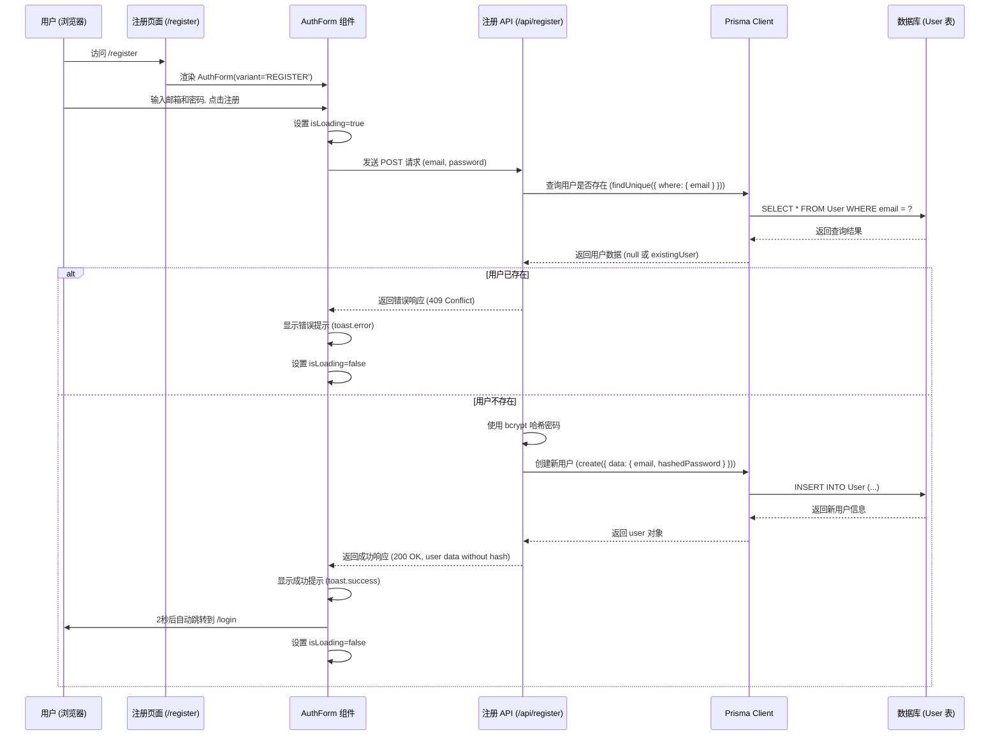
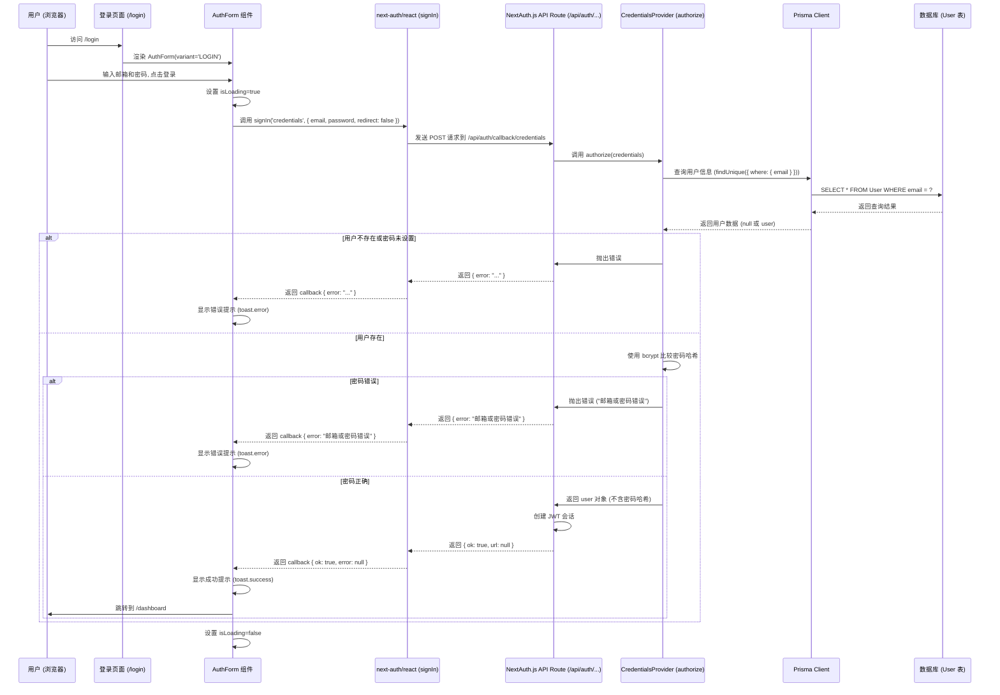

# 用户认证流程

本文档描述 Wrist Word 项目的用户注册和登录流程。

## 1. 注册流程

**流程说明:**

1.  用户访问注册页面。
2.  页面渲染包含邮箱和密码输入的 `AuthForm` 组件。
3.  用户填写信息并提交表单。
4.  `AuthForm` 向 `/api/register` 发送 POST 请求。
5.  API 路由首先检查该邮箱是否已被注册。
6.  如果邮箱已被注册，返回 409 错误。
7.  如果邮箱未被注册，API 使用 `bcrypt` 对密码进行哈希处理。
8.  API 通过 Prisma 在数据库中创建新用户记录。
9.  API 返回成功响应（包含用户信息，但不含密码哈希）。
10. `AuthForm` 显示成功提示，并在短暂延迟后将用户重定向到登录页面。

## 2. 登录流程

**流程说明:**

1.  用户访问登录页面。
2.  页面渲染包含邮箱和密码输入的 `AuthForm` 组件。
3.  用户填写信息并提交表单。
4.  `AuthForm` 调用 `next-auth/react` 的 `signIn` 函数，使用 `credentials` 提供者。
5.  `signIn` 函数向 NextAuth.js 的 API 路由 (`/api/auth/callback/credentials`) 发送请求。
6.  NextAuth.js 核心逻辑调用我们在配置中定义的 `CredentialsProvider` 的 `authorize` 函数。
7.  `authorize` 函数通过 Prisma 查询数据库中是否存在该邮箱的用户。
8.  如果用户不存在，`authorize` 抛出错误。
9.  如果用户存在，`authorize` 使用 `bcrypt.compare` 比较用户输入的密码和数据库中存储的哈希密码。
10. 如果密码不匹配，`authorize` 抛出错误。
11. 如果密码匹配，`authorize` 返回用户信息（不包含密码哈希）。
12. NextAuth.js 核心逻辑接收到用户信息，创建 JWT 会话（可能设置 cookie）。
13. NextAuth.js API 路由向 `signIn` 函数返回成功响应。
14. `AuthForm` 接收到成功回调，显示成功提示，并将用户重定向到 `/dashboard` 页面。
