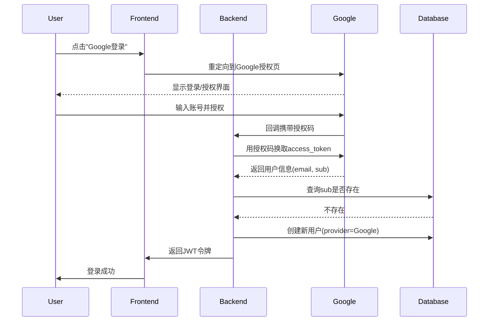

### **一、核心流程图** (使用Mermaid语法)

#### 1.1 用户注册流程
```mermaid
graph TD
    Start[开始] --> RegMethod{选择注册方式}
    RegMethod -->|邮箱注册| EmailCheck[验证邮箱格式]
    EmailCheck --> UniqueCheck[检查邮箱唯一性]
    UniqueCheck -->|已存在| Error1[返回"邮箱已注册"]
    UniqueCheck -->|不存在| PasswordCheck[密码强度校验]
    PasswordCheck -->|强度不足| Error2[提示密码规则]
    PasswordCheck -->|符合要求| SendEmail[发送验证邮件]
    SendEmail --> Wait[等待用户点击链接]
    Wait -->|24小时内未验证| Expire[链接失效]
    Wait -->|已验证| CreateUser[创建用户记录]
    
    RegMethod -->|第三方注册| OAuthInit[跳转授权页面]
    OAuthInit -->|用户取消| Error3[返回登录页]
    OAuthInit -->|用户授权| GetInfo[获取第三方用户信息]
    GetInfo --> CheckUID[检查第三方UID是否存在]
    CheckUID -->|存在| Login[直接登录]
    CheckUID -->|不存在| AutoCreate[自动创建账户]
```

#### 1.2 第三方登录时序图


---

### **二、数据模型 (ER图)**

#### 用户表 (users)
| 字段名          | 类型         | 说明                     |
|-----------------|--------------|--------------------------|
| id             | UUID         | 主键                     |
| email          | VARCHAR(255) | 唯一索引，可为空          |
| password_hash  | CHAR(60)     | bcrypt加密，仅邮箱注册使用 |
| status         | ENUM         | active/inactive/locked   |

#### 第三方认证表 (third_party_auth)
| 字段名          | 类型         | 说明                     |
|-----------------|--------------|--------------------------|
| user_id        | UUID         | 关联users.id             |
| provider       | ENUM         | google/github            |
| provider_uid   | VARCHAR(255) | 第三方平台唯一ID          |
| access_token   | TEXT         | 加密存储                 |

#### 会话表 (sessions)
| 字段名          | 类型         | 说明                     |
|-----------------|--------------|--------------------------|
| session_id     | CHAR(36)     | JWT的jti唯一标识         |
| user_id        | UUID         |                          |
| expires_at     | DATETIME     | 过期时间                 |
| device_info    | VARCHAR(255) | 浏览器/设备信息           |

---

### **三、安全架构设计**
```plaintext
           +---------------------+
           |   HTTPS 加密传输     |
           +----------+----------+
                      |
           +----------v----------+
           | 请求签名验证(防重放)  |
           +----------+----------+
                      |
           +----------v----------+
           |   JWT (HS256签名)    |
           |   Payload:          |
           |   - exp (短期令牌)   |
           |   - jti (唯一标识)   |
           +----------+----------+
                      |
           +----------v----------+
           | Redis Token黑名单    |
           | (登出/失效时记录jti) |
           +---------------------+
```

---

### **四、API文档示例 (Swagger格式)**

#### POST /api/register
```yaml
requestBody:
  content:
    application/json:
      schema:
        type: object
        properties:
          email: 
            type: string
            format: email
          password:
            type: string
            minLength: 8
            pattern: "^(?=.*[A-Za-z])(?=.*\d).+$"
responses:
  201:
    description: 验证邮件已发送
    headers:
      Set-Cookie:
        schema: 
          type: string
          example: session_id=abc; HttpOnly; Secure
  400:
    description: 密码强度不足/邮箱已存在
```

#### POST /api/login/oauth (第三方登录)
```yaml
parameters:
  - name: provider
    in: query
    enum: [google, github]
requestBody:
  content:
    application/json:
      schema:
        type: object
        properties:
          code: 
            type: string  # OAuth授权码
responses:
  200:
    content:
      application/json:
        schema:
          type: object
          properties:
            access_token: 
              type: string
            refresh_token:
              type: string
```

---

### **五、测试用例矩阵**

| 测试场景                 | 输入数据                     | 预期结果               |
|--------------------------|------------------------------|------------------------|
| 正常邮箱注册             | 新邮箱+强密码                | 收到验证邮件           |
| 重复邮箱注册             | 已存在的邮箱                 | 返回400错误            |
| 第三方首次登录           | 新Google账号                 | 自动创建用户并登录     |
| 会话超时后访问           | 过期Token访问API             | 返回401 Unauthorized   |
| 密码重置暴力破解          | 连续5次错误验证码            | 账户锁定30分钟         |

---

### **六、异常处理策略**
1. **第三方服务不可用**：
   - 降级方案：禁用第三方登录按钮，提示用户使用邮箱登录
   - 重试机制：使用指数退避算法重试3次

2. **并发注册冲突**：
   ```python
   # 伪代码示例（使用数据库唯一约束）
   try:
       create_user(email, password)
   except DuplicateKeyError:
       rollback_transaction()
       return "邮箱已被注册"
   ```

3. **JWT泄露处理**：
   - 立即将jti加入黑名单
   - 强制用户重新认证
   - 记录设备指纹用于审计

---

通过以上完整示例，开发团队可以清晰地：
1. 理解用户认证模块的完整交互流程
2. 根据ER图设计数据库表结构
3. 按照API规范进行接口开发
4. 依据测试用例编写自动化测试脚本
5. 实现符合安全规范的身份验证机制 